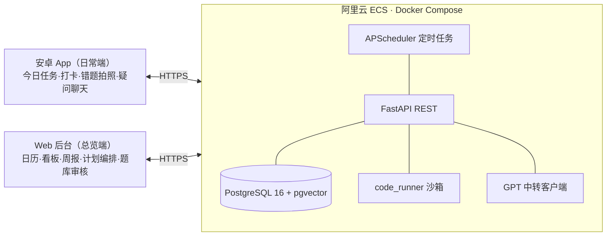
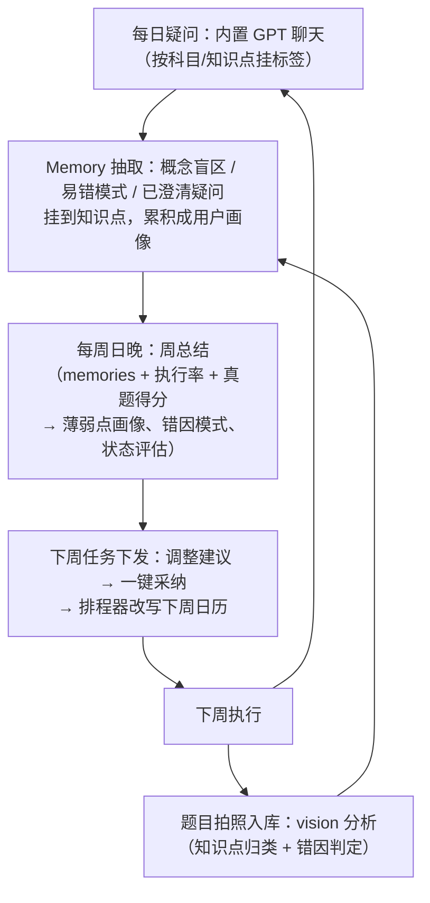

# 11408 备考系统设计文档（自用版）

> 目标：4 个月备考期（7 月中 → 11 月底，考前留维稳期）内，管理 数学一 + 408 + 英语一 + 政治 的任务规划、进度追踪、题库与错题复习，并用 GPT（中转 API）做错因与重难点分析。
> 原则：单人自用，优先省事、可落地，避免过度工程化。

---

## 1. 总体架构



**职责分工（同一套 REST API，两个客户端各取所需）：**
- **安卓 App = 日常高频操作端**：今日任务清单与打卡、题目拍照上传（相机直达）、每日疑问聊天、到期复习卡片、本地通知提醒（早晨计划/复习到期，免推送服务）。Kotlin + Jetpack Compose，离线缓存当日任务（Room），弱网也能打卡后补传。**离线冲突语义：客户端只上报事件（打卡/耗时/拍照，带客户端时间戳），服务端按 last-write-win 归并，carry_count/顺延等派生状态一律服务端计算，客户端不做合并逻辑。**
- **Web 后台 = 总览与重操作端**（电脑大屏）：4 个月日历全貌与计划编排、考纲知识点树管理、看板/真题得分曲线、周总结审阅与一键采纳下周计划、memories 管理、**题库审核台（vision 提取结果确认、题↔知识点映射增删改、解法管理）**。Vue 3 + Vite + TypeScript。
- **部署在阿里云 ECS**（Docker Compose 一键起）：手机随时可达，不再依赖 cpolar 隧道和家里电脑开机；域名 + HTTPS（Caddy 自动证书），API 用 token 鉴权（单用户）。安卓端支持配置服务器地址。

### 技术栈
| 层 | 选型 | 理由 |
|---|---|---|
| 后端 | Python 3.11 + FastAPI + SQLAlchemy | 你已有 Python 环境（uv），生态好接 GPT |
| 数据库 | PostgreSQL 16（Docker/本机服务） | JSONB 存计划 patch/分析结果；pgvector 做 memories/题库语义检索与入库查重；全文检索(pg_trgm/zhparser)比 SQLite FTS5 对中文更好；并发与约束更严谨。备份用 pg_dump 定时导出 |
| Web 后台 | Vue 3 + Vite + TypeScript + Element Plus/Naive UI + ECharts | 后台管理式界面（审核台/知识点树/周报审阅）组件开箱即用；日历用 FullCalendar，图谱用 ECharts graph，题面渲染 markdown-it+KaTeX；TS 类型由 FastAPI OpenAPI 自动生成（openapi-typescript），前后端契约不漂移 |
| 安卓 App | Kotlin + Jetpack Compose + Room + Retrofit | 原生相机/通知/离线；单 module，自用不上架，APK 直接安装 |
| 部署 | 阿里云 ECS + Docker Compose + Caddy(HTTPS) | 2c4g 即可；镜像国内拉取方便 |
| 定时 | APScheduler | 进程内定时，生成每日任务/推送 |
| AI | OpenAI 兼容客户端（自定义 BASE_URL + API_KEY，存 .env） | 兼容任意中转 |

---

## 2. 备考阶段划分（排程引擎的顶层输入）

> 备考期：**7 月中 → 11 月底**（考试 12 月下旬，11 月底之后为考前维稳期）。阶段是 PlanPhase 表的数据，边界与配比均可按周微调；里程碑作为**预警条件**而非死门槛。

| 阶段 | 时间 | 主线 | 四科配比（可调） |
|---|---|---|---|
| **基础期** | 7 月中 ~ 8 月底（约 7 周） | 暑假黄金期，每日可用时长最高。数学：教材+基础讲义全过一遍，配基础题；408：王道一轮（暑假必须过完 DS+组原）；英语：单词每天固定量+精读 10 年前真题阅读；政治：低配比跟马原 | 数40 / 408 35 / 英15 / 政10 |
| **强化期** | 9 月 ~ 10 月中（约 6 周） | 数学：1000 题/严选题分模块刷+错题回炉；408：王道二轮+习题册，开始跨科综合题；英语：近 10 年真题阅读+翻译；政治：9 月起精讲+肖 1000。开学后每日可用时长下调（Availability 按暑假/学期两套配置） | 数35 / 408 35 / 英15 / 政15 |
| **冲刺期** | 10 月中 ~ 11 月底（约 6 周） | 全科真题套卷限时模考为主线（数学近 15 年、408 近 10 年）；题库到期卡片高频回滚；英语作文模板+模考；政治肖八背诵 | 数30 / 408 30 / 英15 / 政25 |
| **考前维稳期** | 12 月初 ~ 考前（约 3 周） | **不排新任务**：只排题库回滚（到期复习卡集中消化）+ 肖四背诵 + 套卷保温 | 以到期复习为准 |

阶段里程碑预警示例：进冲刺期前检查"1000 题完成 ≥80%"、"王道二轮完成"，不满足则周报里标红并给压缩建议，但不阻塞排程。

---

## 3. 功能模块（按优先级分期）

### 交互模型：解题—解惑—打卡（三位一体）
日常高频场景只有三个动作：做题出错/遇难题 → 拍照入库（**解题**）；有概念疑问 → 聊天（**解惑**）；都没有 → 直接记耗时（**打卡**）。安卓端首页按此设计：今日任务列表上每个任务只有三个出口——完成打卡 / 挂一道题 / 挂一个疑问。其余都是低频场景（真题录分每周 1-2 次、周报审阅每周一次、题库审核台攒批处理、背诵卡归入打卡），放 Web 端。

**三个数据流统一汇入知识点图谱（复习质量的度量基础）：**
- **考纲图谱（目标态）**：知识点树 + 前置依赖边 + 分值权重，人工定稿，是“应该掌握的全集”。
- **用户图谱（实际态）**：同一批节点上叠加活动数据——解题流点亮“做过/错过”（ProblemKP 映射），解惑流点亮“问过/澄清过”（Memory），打卡流点亮“学过”（Task 完成）；每个节点的 mastery 是三个流的加权结果。
- **复习质量 = 加权覆盖度**：`Σ(已覆盖节点 weight × mastery) / Σ(全部节点 weight)`，按科目/模块分别计算。它比“任务完成率”更诚实：刷题集中在少数节点覆盖度不涨；高权重节点只打过卡没做过题（覆盖类型单一）也会被标出。

### P0 — 考纲驱动的任务规划引擎 + 日历（第 1 周）
**核心思路：一切计划从考纲出发。** 内置 11408 考纲知识点树：**科目 → 模块 → 知识点**（数一：高数/线代/概率三模块 ≈ 180+ 知识点；408：DS/组原/OS/网络四模块，按王道章节对齐；英一：单词/阅读/写作/翻译等题型模块；政治：马原/毛中特/史纲/思修/时政），每个知识点带**考纲分值权重、预计学时、前置依赖**。

**考纲树校准回路（树不是一次录死的）**：weight/est_hours 初版按考纲分值分布 + 王道页数生成，本质是估计值；系统持续用打卡数据校准——某知识点实际耗时与 est_hours 偏差超阈值（如 ±40%）时，周报中提示修正并一键采纳（同步重算后续排程），让树越用越准。依赖边和节点增删仍为人工专属。

**计划生成流程：**
1. 载入第 2 节的阶段划分（基础/强化/冲刺/维稳）与各阶段四科时间配比。
2. 知识点 × 资料（王道/1000题/真题）展开成任务池，每个任务有类型（读书/习题/默写/真题/背诵/复盘）与预计耗时。
3. 排程器按依赖顺序、阶段配比、**每周 ≥50 小时约束**（Availability 按暑假/学期分别配置每天可用时段，如暑假 10h/学期工作日 8h/周末 11h）把任务铺到每一天，生成**细分到天的任务清单**。

**日历视图（主界面）：**
- 月视图：每天显示各科任务色块 + 当日计划时长，一眼看到 4 个月全貌与阶段里程碑。
- 日视图：当天任务清单（知识点 + 资料 + 预计耗时），打卡、记实际耗时。
- 周条：本周已排 / 已完成小时数对比 50h 目标，不足或超载标色预警。
- **顺延与重排**：没完成自动顺延并重算后续密度；周时长掉到 50h 以下时给出压缩建议（砍低权重知识点的二刷任务）。

### P1 — 进度与复盘看板（知识点图谱为核心视图）
- **图谱热力图**：按考纲树展开，节点大小=考纲权重、着色=mastery，一眼看到“考纲要求高但活动稀疏”的空洞区；每节点可下钻看三流明细（做过哪些题/问过什么/打卡记录）。
- **加权覆盖度曲线**：按科目/模块的复习质量随时间变化，与阶段里程碑对照。
- 四科进度条（按章节/资料完成度）。
- 每日/每周学习时长堆叠图、执行率（计划 vs 实际）。
- 真题得分曲线（按套卷录入各模块得分，如数学：高数/线代/概率分块）。
- 距考试倒计时 + 阶段里程碑预警（如"强化阶段还剩 N 天，1000 题完成 50%"）。

### P2 — 自建题库 + 题↔知识点双向映射 + 间隔重复

**定位：题库是系统的第二个事实核心（第一个是考纲树）。** 所有错题、难题、好题拍照入库，题面与解法结构化存储；知识点的"例题"严格从题库反查，**永远不让模型现编题目**。

**① 入库流水线（拍照 → 结构化 → 人工定稿）：**
1. 安卓端拍照/截图上传（题面、选项、我的错解可分张拍）。
2. vision 模型提取：题面规范化为 **Markdown + LaTeX**，选项、我的作答/错解分字段识别；同时提议知识点归类（枚举约束在考纲树内）与错因判定。
3. **入库查重**：对题面做 embedding（pgvector）相似度检查，疑似重复的挂到已有题目下提示合并。
4. **人工确认队列（Web 端题库审核台）**：逐条审题面、增删改知识点映射、确认错因 → 定稿入库（原图永久留档）。
5. 定稿后自动进 SM-2 复习调度。

**审核台低负担原则（人工确认不能变成每天 20 分钟的负债）**：
- **提案即默认值**：vision 提取结果直接作为表单默认值，改比重录快；支持批量一键全采纳。
- **积压不阻塞主流程**：未确认的题以**草稿态**先进 SM-2 调度（用 vision 提取的题面复习），定稿时修正；审核可攒批周末处理。
- 周报采纳、GPT 解法审核同理：均为“默认提案 + 一键采纳/批量操作”交互。

**② 题、解法、知识点的数据组织：**
- 每题一条 `Problem`：题面 md/LaTeX + 原图 + 来源（试卷/习题册/页码）+ 类型（错题/难题/好题）+ 我的作答与错因。
- **解法独立成表 `Solution`（一题多解）**：每个解法带**方法标签**（换元/构造辅助函数/反证/秩不等式/…）与来源（自己/参考答案/GPT，GPT 解法须经代码验证层）。方法标签独立统计——"总在'构造辅助函数'类方法上丢分"比知识点维度更有信息量。
- **题↔知识点多对多映射 `ProblemKP(problem_id, kp_id, role, weight)`**：
  - `role` 区分**主考点**（这题本质考什么，唯一）与**次考点**（用到但非核心，可多个）；
  - `weight` 为该知识点在此题中的占比（各映射之和为 1）；
  - "知识点 → 例题"反查按 `(role=主考点, weight, 最近错误时间)` 排序取 top-k；
  - 映射由 vision/LLM 提议，**以人工确认为准**。
- **mastery 按映射分摊**：一道错题对多个知识点按 weight 分摊扣分，主考点扣得多；复习成功同理回血。

**③ SM-2 间隔重复调度（草稿态题目也参与）：**
- 到期题目自动出现在当日任务里，复习后按掌握程度（忘了/模糊/掌握）更新下次复习时间。
- 政治/英语单词也可作为"背诵卡片"进这套调度。
- 维稳期的任务几乎全部由该调度供给。

### P3 — AI 学习闭环：每日疑问 + 错题分析 → Memories → 周总结 → 下周任务下发（GPT 中转）

**闭环结构：**


- **每日疑问（内置聊天）**：应用内直接和 GPT 对话（走你的中转），提问时自动带上当前知识点上下文、相关历史 memories 和**题库中该知识点的例题**（ProblemKP 反查，模型只解释"这几道题为什么相关"，不编题；库里没有则明确显示"暂无例题"提示去录）；每轮对话结束后 GPT 抽取「疑问点/澄清结论」存为 memory。
- **错题分析（入库时或事后触发）**：vision 模型识别题目 → 归类知识点（枚举约束）、判定错因、给同类题建议（同类题从题库检索）、生成记忆卡片进 SM-2；同样抽取 memory。
- **Memories 机制**：`Memory(id, kp_id, kind[疑问/错因/澄清/习惯], content, source[chat/problem], created_at, decay)` —— 是画像的原材料，可人工查看/删除；旧记忆随复习成功逐渐"衰减归档"。
- **周总结**：薄弱点排序从“错题密度”升级为**覆盖度缺口**（考纲权重 × 低 mastery × 活动稀疏标红）、错因模式与**方法标签统计**（如"线代大题总在秩的判定上丢分"）、本周疑问主题聚类（同一知识点疑问型 memory 密度高 → 自动建议下周加一个复盘任务）、执行率复盘、阶段里程碑检查（见第 2 节）。
- **下周任务下发**：总结附带可执行的计划 patch（JSON），你确认后排程器自动改写下周日历——这是闭环的"落地"一步，而不是只给建议。
- 配置：`.env` 中 `OPENAI_BASE_URL` / `OPENAI_API_KEY` / `MODEL`（需支持 vision），全部你本地保存。

### P4 — 与现有"考研学习"工作区打通（可选）
- 后端扫描桌面工作区：解析各科 README/notes.md 的 `[ ]/[x]` 进度勾选、git 提交记录 → 自动同步章节完成度，减少手动打卡。
- 数据结构"一键复原"练习轮次也可计入默写训练记录。

---

## 3.5 三层职责划分：数据库（事实层）/ RAG（约束层）/ LLM（生成层）

> 原则：**凡是要求准确的走数据库；凡是给 LLM 的上下文走 RAG 检索注入；LLM 只负责理解、解释和建议，永远不做事实的最终来源。**

### ① 数据库层（Source of Truth，保证准确性）
| 数据 | 说明 |
|---|---|
| 考纲知识点树 | 科目/模块/知识点、分值权重、学时、依赖——**人工校对后入库，LLM 不得修改**；LLM 归类题目时只能从这棵树中"选择"知识点 ID（枚举约束），不能自造知识点 |
| 题库（Problem/Solution/ProblemKP） | vision 提取后**规范化为 Markdown + LaTeX 存库（原图留档）**；题面、解法、题↔知识点映射均需人工确认一次再定稿；例题检索只走题库，LLM 不得生成题目 |
| 任务/日历/打卡/耗时 | 排程器（确定性算法）生成和维护，不经 LLM |
| SM-2 复习参数、掌握度 mastery | 公式计算，确定性（mastery 按 ProblemKP weight 分摊更新） |
| 真题得分、DailyLog | 手动录入的客观数据 |
| Memory 条目 | LLM 抽取产生，但**以结构化行存库**（kind/kp_id/content），可人工审改删 |

### ② RAG 层（检索注入，约束 LLM 的分析）
检索策略：知识点 ID 关联检索（ProblemKP）为主 + PostgreSQL 全文检索（pg_trgm，中文可加 zhparser）；语义检索用 **pgvector** 存 memories/题面的 embedding（走中转的 embedding 接口或本地 bge-small），同库一体化，不另搭向量库；embedding 同时服务题库入库查重。
| 场景 | 注入什么 |
|---|---|
| 错题分析 | 该知识点的考纲定义与权重 + 该知识点历史题目（ProblemKP 反查，md/LaTeX）+ 相关 memories → 强制 LLM 在既有画像背景下判定错因，输出受 JSON Schema 约束（知识点 ID 必须属于考纲树） |
| 每日疑问聊天 | 当前知识点考纲条目 + 相关历史 memories + 题库例题（主考点优先 top-k）→ 回答贴合你的薄弱背景，避免泛泛而谈 |
| 周总结 | 本周全部 memories + 题库错因/方法标签统计 + 执行率 + 真题分块得分（全部由 SQL 聚合成事实表格再交给 LLM）→ LLM 只做归纳和建议，数字不允许它算 |
| 下周任务下发 | 候选任务池（数据库生成）+ 薄弱点排序（公式算好）→ LLM 只在候选集内选择/排序，输出 plan patch 经排程器校验（依赖、周 50h 约束、当前阶段配比）后才落库 |

### ②.5 代码验证层（数一 & 408 专属：代码先行，结论只能来自执行结果）
> 对数学一和 408 的解惑/错题分析，LLM 不允许"口算"给结论——采用**代码先行（code-first）两段式**：回答前必须先写可执行代码，沙箱跑出真实结果后，才允许基于结果给最终解答。结论永远来自沙箱的 stdout，解题思路是对结果的解释，从机制上堵死"幻觉先入为主、验证沦为走过场"。入题库的 GPT 解法（Solution.source=GPT）必须先通过本层验证。

| 科目 | 验证方式 |
|---|---|
| 数学一（高数/线代/概率） | 强制生成 **Python + SymPy/NumPy/SciPy** 代码：极限/导数/积分/级数用 SymPy 符号计算复核；线代（秩/特征值/相似对角化）用 numpy/sympy.Matrix 数值+符号双验证；概率用 scipy.stats 或蒙特卡洛模拟对照解析解 |
| 408-数据结构/算法 | 生成 **C（或 Python 参考实现）** 并附测试用例实际运行：如 KMP next 数组、AVL 旋转、排序过程逐步 trace 输出，与 LLM 的文字推演对照 |
| 408-组原 | 数制转换/浮点表示/Cache 映射/流水线计算题用 Python 逐步计算脚本验证（如 IEEE754 用 struct 直接打位） |
| 408-OS | 调度算法（时间片/优先级）、页面置换（LRU/CLOCK）、银行家算法等用 Python 模拟器跑出甘特图/命中序列 |
| 408-网络 | CRC、子网划分/最长前缀匹配、TCP 窗口/超时计算用脚本验证（可复用你计网项目 experiment/ 的思路） |

实现要点：
- 后端 `code_runner` 服务：子进程沙箱（超时/内存限制/禁网），支持 Python(uv 环境预装 sympy/numpy/scipy) 与 gcc 编译 C。
- Prompt 契约（两段式，代码先行）：**第一轮** schema 固定为 `{思路草稿, code}`，**禁止输出结论**；后端沙箱执行 code；**第二轮**把 stdout 回注给 LLM，基于执行结果生成 `{最终解答}`——结果与思路草稿矛盾时必须修正思路，不允许改口硬圆。最终回答中代码+执行输出作为一等内容展示，思路是对结果的解释。执行失败自动修正重试一轮，仍失败则在 UI 上明确标注「未经代码验证」且不展示结论性内容。
- 体验：验证需要 10-30 秒，UI 做成**流式两段展示**——思路草稿先出（标“验证中…”），沙箱结果和最终解答后到，不让聊天卡死等。
- 英语/政治不走此层（无可执行验证物），靠 RAG 注入考纲与原文约束。

### ③ LLM 层（理解与生成，不做事实源）
| 用途 | 输出去向 |
|---|---|
| 解惑问答（每日疑问） | 对话内容存 ChatMessage，结论抽取为 Memory |
| 题目图片识别 → md/LaTeX + 知识点/错因提议 | 进入人工确认队列（题库审核台），确认后定稿 |
| 错因判定、知识点归类 | 受 Schema/枚举约束的结构化输出，人工可改 |
| GPT 解法 | 经代码验证层后作为 Solution(source=GPT) 入库 |
| 周总结文字、计划调整建议 | 建议性内容，plan patch 需确定性校验 + 人工采纳 |
| 记忆抽取 | 结构化 Memory 行，可人工管理 |

**一句话：数据库管"是什么"（考纲树 + 题库），RAG 管"LLM 看什么"，LLM 管"怎么解释和建议"；LLM 的一切结构化输出要么受枚举/Schema 约束，要么过确定性校验或人工确认才入库。**

---

## 3.8 UI 设计参考（Web 端 = Codex 桌面版 / 安卓端 = Kimi 手机版）

> 参考图存放于工作区：`web端页面设计参考/`（Codex 桌面版截图 ×2）、`安卓端界面设计参考/`（Kimi 手机版截图 ×4）。两者共同的设计语言：**深色主题（近黑背景 + 深灰卡片 + 高对比白字）、大圆角、无边框分组卡片、图标+文字的极简导航、底部常驻输入条作为核心交互入口**。

### Web 后台（参考 Codex 桌面版）

| 参考图 | 索引 |
|---|---|
| 主界面（侧栏+引导+输入框） |  |
| 设置页（左导航分组+开关卡片） |  |

**整体布局**：左侧固定侧栏（~260px，浅于主区的深灰底）+ 右侧主内容区，主区顶部干净无冗余工具栏。

- **侧栏结构（对照 Codex 的「新建任务/已安排/插件/拉取请求 + 项目 + 任务」三段式）**：
  1. 顶部动作区：`今日`（对应 Codex"新建任务"位，最高频入口）、`日历`、`图谱看板`、`题库审核台`（带待审数角标）、`周报`；
  2. 中段「科目」区（对应 Codex"项目"区）：数学一 / 408 / 英语一 / 政治 四个入口，点击进入该科的模块-知识点树与进度页，当前选中项高亮为浅灰圆角条；
  3. 下段「任务」区：本周待办摘要（已排/已完成小时数）；
  4. 左下角固定 `设置`（对照 Codex 左下角设置 + 状态徽标位，可放"同步状态/备份状态"小徽标）。
- **主区空态/引导（对照 Codex 中央大标题"我们应该在 xx 中构建什么？"）**：日始进入时主区居中显示当日引导语（如"今天计划 8.5h · 还差 42h 达成本周 50h"），下方一排 4 个快捷卡片（对照 Codex 的四个功能卡）：`生成本周计划`、`录入真题得分`、`处理审核队列`、`查看薄弱点`。
- **底部常驻输入框（对照 Codex 底部"随心输入"大输入条）**：全局疑问聊天入口，左侧 `+` 附件（贴图录题），输入条上方显示当前上下文胶囊（对照 Codex 的「项目/本地/分支」胶囊 → 我们显示「科目/知识点/模型」），右下角模型与推理档位切换（对照"5.5 高"下拉）。
- **设置页（对照 Codex 设置）**：独立页面、左侧分组导航（`个人`：常规/外观/快捷键；`集成`：GPT 中转配置(BASE_URL/KEY/MODEL)、code_runner、备份；`数据`：考纲树管理、阶段与配比、Availability、归档），右侧为"标题+说明+右侧控件（开关/下拉）"的行式卡片，危险或重要开关附带蓝色"了解更多"式说明链接。

### 安卓端（参考 Kimi 手机版）

| 参考图 | 索引 |
|---|---|
| 首页（聊天式主界面+底部输入条） |  |
| 侧滑抽屉（功能入口+历史会话） |  |
| 定时任务（空态+双创建方式） |  |
| 设置页（分组卡片列表） |  |

**整体结构**：单 Activity 聊天式主界面 + 左侧滑抽屉 + 独立设置/定时任务页，纯黑背景省电（OLED）。

- **首页（对照 Kimi 首页）**：
  - 顶部栏：左侧汉堡按钮（开抽屉，带未读蓝点=到期复习/待审提醒），中央胶囊显示**当前上下文**（对照「Kimi K2.6 思考」→ 我们显示「科目 · 知识点」或「模型档位」，点击切换）；
  - 主区：日始空态居中显示问候+今日概要（对照"嗨 小辜，今天要和 Kimi 一起做点什么"→"今日 6 个任务 · 2 张到期卡"），下方一个绿色胶囊快捷入口（对照"预测冠军队"→"开始今日第一个任务"）；有会话时为消息流，today 任务卡内嵌其中；
  - 底部：一排横滑功能胶囊（对照 Kimi 的 Agent/PPT/Kimi Claw → 我们放 `打卡`、`拍题`、`复习卡`、`真题录分`）+ 圆角大输入条（对照"尽管问，带图也行"）——**三位一体落在同一输入条：发文字=解惑、发图片=解题（拍照录题）、胶囊按钮=打卡**，右侧语音/发送按钮。
- **侧滑抽屉（对照 Kimi 侧栏）**：顶部头像+昵称+扫码位（放服务器连接状态）；功能入口列表：`今日任务`、`日历`、`复习卡`（对照"定时任务"位）、`题库`、`看板`；下方「历史会话」按时间列出疑问聊天记录（带缩略图的沿用 Kimi 样式，错题分析会话显示题目缩略图）；底部搜索框（全局搜题/搜会话）+ 新建会话按钮。
- **提醒/定时页（对照 Kimi 定时任务页）**：管理本地通知——早晨计划推送、复习到期提醒、周日晚周报提醒；空态插画+说明文案+底部两个大按钮（对照"手动创建/对话创建"→"手动创建 / 按计划自动"）。
- **设置页（对照 Kimi 设置）**：分组圆角卡片列表，每行"图标+标题+当前值+右箭头"：`账户`（服务器地址/Token）；`个性化`（记忆管理=memories 入口、常用语）；`通用`（主题/文字大小/消息通知）；`帮助`。

### 组件与视觉规范（两端统一）
- 色板：背景 #0D0D0D~#1A1A1A、卡片 #202124、主文字 #F5F5F5、次级文字 #9AA0A6、强调色用单一品牌色（建议蓝，Kimi 蓝球同款系）+ 语义色（到期红/达标绿/预警橙）。
- 圆角：卡片 12-16px、输入条与按钮全圆角（胶囊）；间距 8pt 网格。
- Web 端 Element Plus/Naive UI 走暗色主题定制变量；安卓端 Compose Material3 darkColorScheme 对齐同一色板。
- 数学/408 题面在两端均以 markdown-it/Compose-Markdown + KaTeX 渲染，代码验证输出用等宽字体终端样式卡片（深色底+浅色代码）。

---

## 3.9 使用体验与留存设计（目标：每天真的会用，用满 4 个月）

> 自用系统最大的失败模式不是功能不够，而是**第 3 周开始嫌麻烦不用了**。本节按"摩擦 → 节奏 → 信任 → 动机 → 弹性"五个维度系统化设计留存。

### ① 零摩擦原则（高频操作的步数预算）
每个高频动作设硬性步数上限，超了就是设计失败：
- **打卡 ≤2 步**：任务卡内置计时器（点开始→学习→点结束，实际耗时自动填），忘开计时也可事后一键"按预计时长记账"再微调；安卓桌面小组件（Widget）显示今日任务+一键开始/打卡，不打开 App 也能完成整天记录。
- **拍题即走 ≤3 步**：拍照→（可选）选科目→发送，立即返回学习；vision 提取、查重、归类全部后台异步，结果进审核队列攒批处理。限时做题中途录题，任何多余确认步骤都会导致放弃录题。
- **提问 ≤1 步**：输入条常驻，上下文（科目/知识点）自动从当前任务推断，不强制手选；猜错了在会话里一键改挂。
- **Web 全局快捷键**：`/` 聚焦输入框、`c` 快速打卡、`r` 进审核台、`g` 图谱、`t` 今日——Codex 风格界面配快捷键顺理成章。
- **性能预算**：安卓首屏（今日页）冷启动 <1.5s、打卡响应即时（本地先写 Room 再同步）；图片上传前客户端压缩（长边 1600px），弱网可用。

### ② 每日节奏（系统主动找你，而不是等你想起它）
固定三个触点，全部本地通知/ntfy，不需要你"记得打开 App"：
- **晨报（可配置，如 7:30）**：通知直接展开今日任务清单 + 到期卡数 + 一句话昨日复盘（"昨日 7.2h/计划 8h"），不点进 App 就知道今天干嘛。
- **日终收口（如 22:30）**：若当日有未打卡任务，一条温和提醒支持通知栏内快速补记；全部完成则不打扰。
- **周报故事页（周日 21:00）**：做成 2 分钟可读完的"故事页"而非长报表——本周覆盖度变化 → Top 薄弱点 → 错因/方法模式 → 建议 patch → 底部一键采纳；读完顺手把下周计划定了。
- 通知全部可单独关闭，绝不叠加营销式噪音；一天最多 3 条。

### ③ 复习卡体验（使用频率最高的界面，按 Anki 的成熟度打磨）
- 全屏卡片流：先题面（md/LaTeX 渲染）→ 点击/上滑翻面看解法与我的错因 → 底部三个大按钮「忘了 / 模糊 / 掌握」→ 自动切下一张；支持左右滑跳过/回看。
- 卡片上显示知识点面包屑与上次间隔，掌握后给下次到期日反馈（"3 天后再见"）。
- 到期卡按科目分组，可"只刷数学"；单次会话默认 ≤20 张，避免积压 100 张导致的心理崩溃（超出部分自动匀到后两天）。
- 草稿态题目（未人工定稿）也进卡流，卡面标"草稿"角标，复习时可顺手修正题面——复习即审核，摊薄审核负担。

### ④ 信任与容错（一次数据丢失/一次卡死 = 永久弃用）
- **离线优先**：打卡/计时/拍照在断网时全部可用（本地排队，恢复后补传）；同步状态在侧栏/抽屉常显（"已同步 / 3 条待传"）。
- **降级明确**：GPT 中转不可用时，聊天入口显示明确降级提示（"AI 暂不可用，问题已存草稿"），提问存为草稿待恢复后重放；code_runner 超时则按「未经代码验证」流程展示，绝不静默失败或无限转圈。
- **备份可见**：设置页显示最近一次 pg_dump 时间与大小；备份失败推送告警。数据可随时全量导出（Markdown + 图片 zip），消除"数据被锁死在系统里"的顾虑。
- **AI 输出可撤销**：一键采纳的 plan patch 支持一键回滚上一版日历；memory 可批量删；审核台误确认可重开。

### ⑤ 动机与弹性（防"落后 → 负罪 → 弃用"死亡螺旋）
- **轻度正反馈**：连续达标 streak、打卡完成微动效、周覆盖度上涨的绿色增量——克制使用，不做积分商城式游戏化。
- **落后不惩罚**：顺延任务不用刺眼红色堆积成"欠账墙"；连续 2 天大幅未完成时，系统主动给「一键从今天重排」——按剩余时间重新铺平后续计划，而不是让你面对滚雪球的逾期列表。心理学上"重新开始"比"补欠账"留存率高得多。
- **弹性缓冲**：排程默认每周留 0.5~1 天缓冲（不排新任务，用于消化顺延/生病/突发）；请假模式：标记某天不可用，自动重排且不计入执行率分母。
- **倒计时与里程碑**：考试倒计时常驻侧栏；阶段切换时给一页阶段总结（本阶段覆盖度/完成率/最佳进步模块），制造节点感。
- **防弃用监控**：连续 3 天零交互时发一条 ntfy（"系统 3 天没有记录了，回来先花 30 秒补个卡？"），并降低当周计划密度——把回归门槛降到最低。

### ⑥ 外观与细节
- 深/浅色跟随系统（参考图均为深色，浅色做二等公民但可用）。
- 所有列表操作支持批量（审核台、memories、通知）；所有耗时操作有进度反馈。
- 安卓端支持系统分享入口：从相册/截图直接"分享到备考系统"录题。

> 落点：①③ 融入 P0/P2 的验收标准（步数上限、卡流交互）；② 的三触点由 APScheduler+本地通知实现；④⑤ 是排程器与同步层的需求（缓冲日、请假模式、一键重排、回滚）；⑥ 为实现期注意项。

---

## 4. 数据模型（核心表）

```
Subject(id, name)                          # 数学一/408/英一/政治
Module(id, subject_id, name, order)        # 高数/线代/概率; DS/组原/OS/网络...
KnowledgePoint(id, module_id, name, weight,# weight=考纲分值权重(初版估计)
     est_hours, prereq_ids[], order,       # est_hours 由打卡实耗持续校准
     mastery)                              # mastery=0~1 掌握度(三流加权,可人工修正)
Material(id, name, type)                   # 王道书/1000题/真题卷/网课...
PlanPhase(id, name, start, end,            # 基础/强化/冲刺/维稳(见第2节)
     subject_ratio_json, milestones_json)  # 阶段配比 + 里程碑预警条件
Availability(period, weekday, hours)       # period=暑假/学期 两套每日可用学时
Task(id, kp_id, material_id, type,         # 读书/习题/默写/真题/背诵/复盘
     planned_date, est_minutes, status,
     actual_minutes, done_at, carry_count) # carry_count=顺延次数

# ---- 题库 ----
Problem(id, content_md,                    # 题面 Markdown+LaTeX(人工定稿)
     images[], source_ref,                 # 原图留档 + 来源(试卷/册子/页码)
     kind,                                 # 错题/难题/好题
     my_answer_md, cause,                  # 我的作答/错解 + 错因枚举
     note, ai_analysis_json,               # 我的笔记 + GPT 分析缓存
     embedding,                            # pgvector: 语义检索+入库查重
     ef, interval_days, due_date, reps)    # SM-2 参数
Solution(id, problem_id, content_md,       # 一题多解
     method_tag, source, verified)         # 方法标签; 来源=自己/答案/GPT; GPT解法须过代码验证
ProblemKP(problem_id, kp_id, role, weight) # 多对多: role=主考点(唯一)/次考点; weight=占比(和为1)
                                           # 知识点→例题反查按(role,weight,最近错误时间)排序

ExamRecord(id, paper_name, date,
     section_scores_json, total)           # 真题分块得分
DailyLog(id, date, minutes_by_subject_json)
ChatSession(id, kp_id, title, created_at)  # 每日疑问对话
ChatMessage(id, session_id, role, content)
Memory(id, kp_id, kind, content, source,   # kind=疑问/错因/澄清/习惯; source=chat/problem
     created_at, decay, archived)          # 用户画像原材料
AIReport(id, week, content_md,             # 周总结
plan_patch_json, adopted)                  # 下周任务调整 patch 及是否采纳
```

掌握度 `mastery` 计算口径（**初版用简单可解释的规则，不拟合公式；图谱 UI 上每节点可看构成明细并人工修正**）：
- **打卡流给基线且设上限**：读完/听完只能把 mastery 抬到 ~0.3，防止“只学不练”虚高。
- **解题流主导**：错题密度、复习成功率、真题分块得分加权更新；**一道题的影响按 ProblemKP.weight 分摊，主考点权重最大**。**防刷水**：做题对覆盖度的贡献按该题 role/weight 与复习结果折算，重复刷同一节点的简单题边际递减，不会把节点刷亮。
- **解惑流不直接动 mastery**，但疑问型 memory 密度高作为薄弱信号参与排序。

薄弱点 = weight × (1 - mastery) × 活动稀疏修正 排序；复习质量 = 加权覆盖度（见第 3 节交互模型）。

## 5. API 草案

```
GET  /api/syllabus              # 考纲知识点树(科目-模块-知识点)
GET  /api/calendar?month=       # 日历视图数据(每日任务/时长/周合计)
GET  /api/today                 # 今日任务(计划任务+到期复习卡)
POST /api/tasks/{id}/done       # 打卡(带实际耗时)
POST /api/plan/generate         # 由阶段模板生成/重排计划
GET  /api/dashboard             # 看板聚合数据
GET  /api/graph?subject=        # 知识点图谱(节点mastery/三流明细/加权覆盖度)

POST /api/problems              # 拍照录题(multipart) → vision 提取进确认队列
GET  /api/problems/pending      # 题库审核台: 待确认队列
POST /api/problems/{id}/confirm # 定稿: 题面/知识点映射/错因人工确认入库
GET  /api/problems?kp_id=       # 知识点→例题反查(主考点优先 top-k)
POST /api/problems/{id}/solutions   # 添加解法(方法标签; GPT 解法自动走代码验证)
POST /api/problems/{id}/review  # 复习反馈(忘了/模糊/掌握) → SM-2 更新

POST /api/chat                  # 每日疑问对话(自动附知识点上下文+memories+题库例题)
GET  /api/memories?kp_id=       # 查看/管理画像记忆
POST /api/ai/analyze/{id}       # 单题 GPT 分析(vision) + memory 抽取
POST /api/ai/weekly-report      # 生成周总结 + 下周计划 patch
POST /api/ai/adopt-plan         # 一键采纳 → 排程器改写下周日历
GET  /api/workspace/sync        # 扫描考研学习目录同步进度
```

## 6. 目录结构（落地时）

```
考研学习/备考系统/
├── backend/
│   ├── app/ (main.py, models.py, routers/, services/{planner,sm2,ai,problem_bank,workspace_sync}.py)
│   ├── .env.example            # OPENAI_BASE_URL / OPENAI_API_KEY / MODEL / NTFY_TOPIC
│   └── pyproject.toml (uv)
├── web/       (Vue3+Vite+TS Web 后台: 日历编排/知识点树/看板/周报审阅/memories/题库审核台)
├── android/   (Kotlin+Compose App: 今日/打卡/拍照录题/聊天/复习卡片)
├── docker-compose.yml (PostgreSQL 16 + pgvector)
└── data/ (problem_images/, backups/  # pg_dump 定时导出)
```

## 7. 实施排期建议（配合备考，不喧宾夺主）

| 周 | 交付 | 说明 |
|---|---|---|
| 第 1 周 | P0 任务规划 + 今日打卡（可用 MVP） | 载入第 2 节阶段模板，立刻开始用，边用边补 |
| 第 2 周 | P2 题库 + 双向映射 + SM-2 | 对分数收益最大，优先于看板 |
| 第 3 周 | P3 AI 分析（单题 + 周报）+ 代码验证层 | 接你的中转 API |
| 第 4 周 | P1 看板 + P4 工作区同步 + 推送 | 锦上添花 |

> 开发全部由我完成，你只需要每周确认一次方向；总投入控制在你备考时间的 0。

## 8. 风险与取舍
- **不做**：多用户/权限、复杂通用题库 OCR（只针对自己拍的题调 prompt）——自用不值得。
- 图片题目的 GPT 提取依赖中转是否支持 vision 模型；不支持则先手动输入题目文字。
- 题库质量靠人工确认兜底：vision 提取和知识点映射提议可能出错，审核台必须让"改"比"重录"快；各处人工确认叠加的日均负担要监控，守住"默认提案+批量采纳+草稿态不阻塞"三原则。
- 阿里云上跑 code_runner 沙箱需隔离（独立容器、资源限制、禁网），避免 LLM 生成代码影响主服务；公网 API 全部 token 鉴权。
- 安卓 App 不上架，直接装 APK；后续更新用 App 内自查版本 + 下载新 APK。
- 数据安全：PostgreSQL + 图片全在服务器；APScheduler 每日 pg_dump 到 `data/backups/`，建议每周再拷贝到网盘。
- PostgreSQL 比 SQLite 多一份运维；换来的是 pgvector 语义检索/查重、更好的中文全文检索和 JSONB——对 RAG 层和题库值得。
